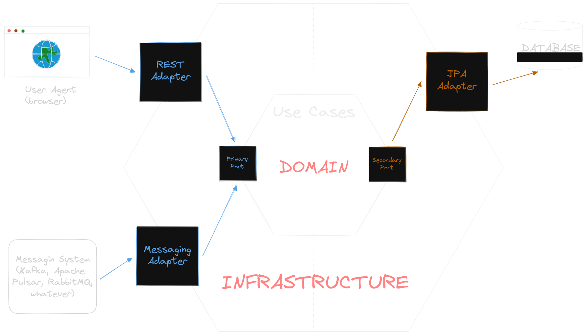
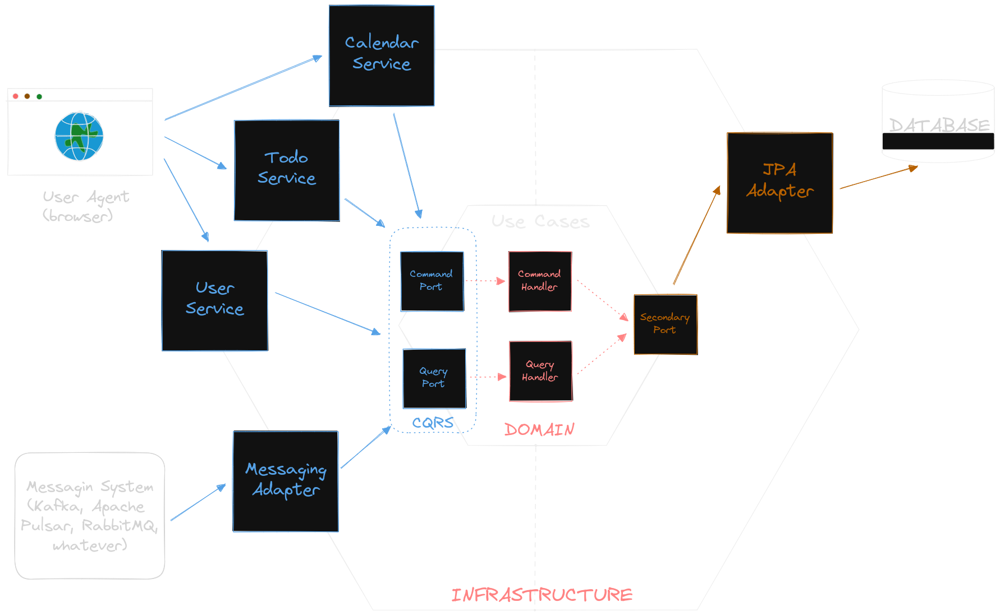
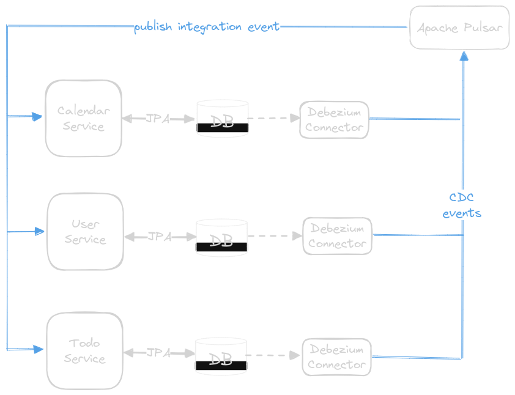

# Reactive TODOs

### Active challenges

* Externalize user authentication with external Identity Provider
    * Keyclock is a good open source option, easy to integrate with Quarkus
* Add calendar functionality 
    * Calendar domain model
    * Calendar repository
    * Calendar commands & queries
    * Calendar command & queries handlers
    * Calendar resource (REST)
* Integrate with Debezium & Apache Pulsar
    * Build Outbox implementation to update User, Todo and Calendar based on domain events
    * Domain events will be generated by Debezium
    * Apache Pulsar (similar to Kafka) to use as transport layer for events delivery
* Split monolith into microservices
    * User microservice
    * Todo microservice
    * Calendar microservice
* Create docker-swarm script to set-up local development cluster
* Create GitHub actions
    * Run E2E tests
    * Build project artifacts and publish to public nexus repository
    * Build docker images and publish to public repository
    * Deploy application to development cluster
    * Deploy application to production cluster

### Additional challenges

* Improve performance of **getTodosQuery**
* Write **README.md**
    * Project scope
    * Architectural overview
    * How to run locally

### Spikes

* Is it worth implementing Aggregate Root pattern for the domain layer?
* Is it worth using Apache Pulsar with Debezium for such small project?
* Good practices for handling authentication/authorization in micro-service cluster

### Ports & Adapters Diagram

This project is based on popular architecture "Ports & Adapters" also some creeps call it "Hexagon" 'till they figure
out what it is actually is.

The idea is really simple, we have ports & adapters, which can be primary (driving) or secondary (driven).
For this project I've implemented CQRS based on VertX EventBus which can act as Mediator.

* **Primary Adapters**
    * REST
    * Messaging System
* **Primary Ports**
    * Commands (change domain model state)
        * User Commands
        * Todo Commands
        * Calendar Commands
    * Queries (query models)
        * User Queries
        * Todo Queries
        * Calendar Queries
* **Secondary Adapters**
    * Database drivers
        * postgresql
* **Secondary Ports**
    * Repositories
        * User Repository
        * Todo Repository
        * Calendar Repository
* **Domain**
    * Domain Models
        * User Model
        * Todo Model
        * Calendar Model
    * Command Handlers
        * User Command Handlers
        * Todo Command Handlers
        * Calendar Command Handlers
    * Query Handlers
        * User Query Handlers
        * Todo Query Handlers
        * Calendar Query Handlers

#### High level overview

#### Adding project specific details

### Change-Data-Capture Flow Diagram

