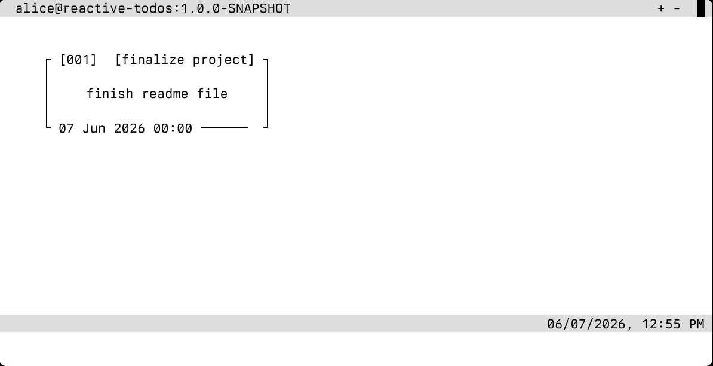
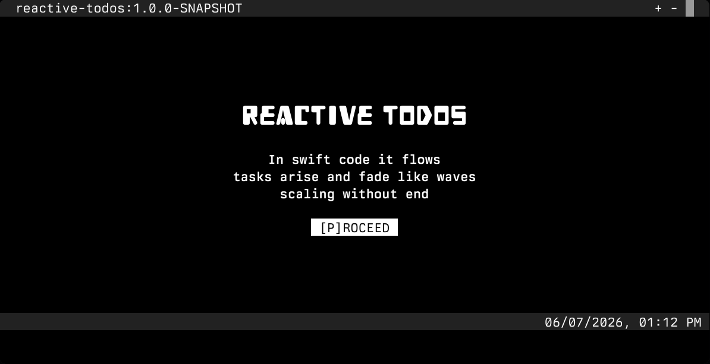
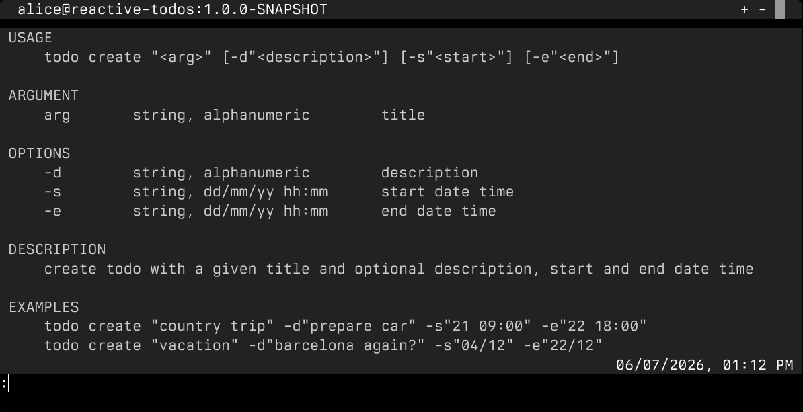
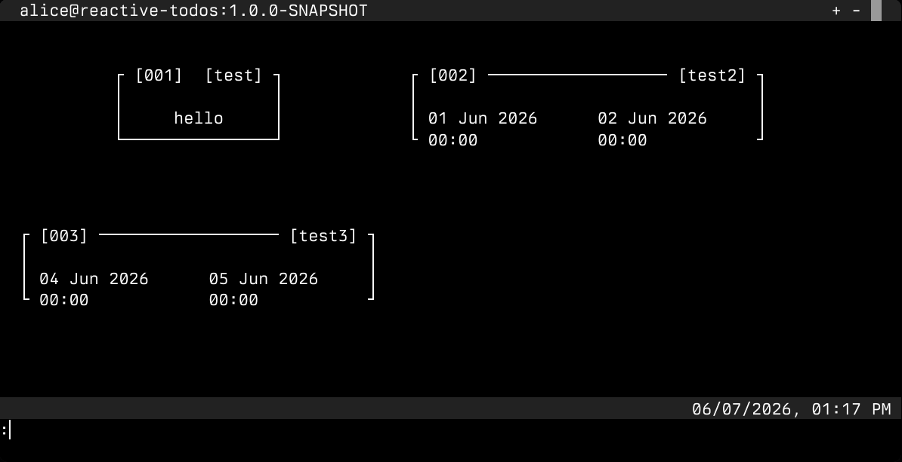
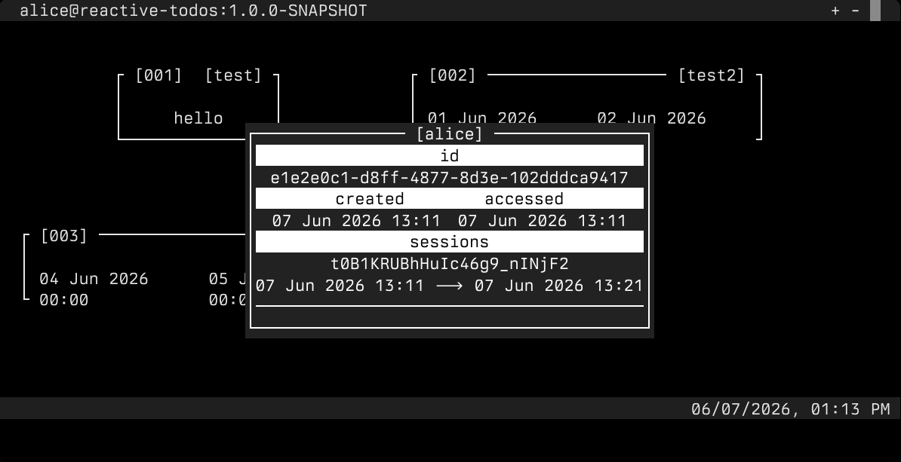
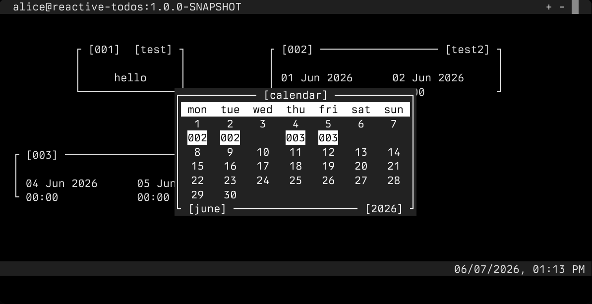

# Preview

<div style="margin-top: 2rem" align="center">
    <picture>
      <source media="(prefers-color-scheme: dark)" srcset="logo/demo-dark.png">
      
    </picture>
</div>

## Motivation

I have always disliked the way most web applications are built. My gut feeling told me that something was wrong, but because I lacked
experience and did not fully understand how the web had evolved, I could not clearly explain where things had gone off track.

Frameworks like Angular, React, Vue, and others often feel bloated to me. They seem to suffer from a fundamental problem at the root of
their design, which is why they constantly try to reinvent themselves. In my opinion, the culprit is that many modern frameworks ignore what
the browser already gives us out of the box. Combined with REST and hypermedia, the web should be simple. Instead, we have made it
unnecessarily complicated.

At some point, I discovered htmx, a hypermedia library created by Carson Gross. It described a way of building web applications that deeply
resonated with me, and I felt that this was the right direction. I bought the book, and by the end of that journey, I was convinced that
much of the modern web had taken the wrong path. For many applications, the true way to build slim and efficient web interfaces is to
embrace hypermedia.

This project is my playground for exploring how to build a hypermedia-driven web application.

# Overview

My personal attempt to implement a todo application and learn new technologies along the way. This project sheds light on how to build a
slim and efficient hypermedia-driven web application backed by the reactive Quarkus framework.

Hexagonal architecture is used as the foundation of the project. I like how it allows me to split the application into distinct layers and
keep the system decoupled. It also makes the application easier to scale and maintain.

For the UI I chose a TUI-like interface implemented with the help of a [webtui](https://github.com/webtui/webtui) library.

## Project Structure

```
.
├── core
├── app
├── adapters
│   ├── inbound
│   │   └── rest-adapter
│   └── outbound
│       └── jpa-adapter
├── boot
├── e2e
├── library
└── framework
```

| module       	 | description                                                                                                                                                                    	 |
|----------------|----------------------------------------------------------------------------------------------------------------------------------------------------------------------------------|
| core         	 | The core layer that defines domain models and interfaces, also known as ports.                                                                                                 	 |
| app          	 | The application and business logic layer. It defines handlers for inbound calls and relies on outbound adapters to interact with the database.                                 	 |
| rest-adapter 	 | An inbound REST adapter that provides HTTP endpoints for interacting with the todo application. It uses htmx and Qute templates to render the UI and handle user interactions. 	 |
| jpa-adapter  	 | An outbound adapter that provides JPA repositories for interacting with the database.                                                                                          	 |
| boot         	 | The bootstrapping layer is responsible for starting the Quarkus application. It also contains application configuration.                                                       	 |
| e2e          	 | Integration tests.                                                                                                                                                             	 |
| library      	 | A simple helper library that contains my custom implementations, such as Option and Tuple, inspired by Rust.                                                                   	 |
| framework    	 | A custom framework implementation is used to reduce the amount of boilerplate code.                                                                                            	 |

## Usage

As I mentioned earlier, this web application has a Vim-like interface, and all interactions are performed through the command-line interface
at the bottom of the screen. There is also a `Shift+:` keybind that focuses the CLI, so you do not need to use the mouse at all.

If a request fails, an error message is displayed above the CLI, press `Esc` to dismiss it.

You can also change the theme and font size using the buttons in the top-right corner of the screen.

### Login

A simple page whose only function is to redirect the user to the identity provider and then back to the todos page. You can initiate the
redirect by pressing P.



### Command Line Interface

There are multiple commands available. Use help to see what is implemented. You can also use help with a specific command to see more
details.



### Todos

You can create, list, update, and delete todos. See the details of each command to understand how to build the query.



### User

A simple command that shows user information.



### Calendar

A simple command that shows the user's calendar with reflected todos if those todos have any time-related markers such as
start or end dates.



# Getting Started

## Prerequisites

* maven 3.8.6+
* java 25+
* docker

## Installation

Since I don't provide any binary distribution, you need to clone the repository and build the app yourself.

```shell
git clone https://github.com/thatwhichisdev/htmx-qute-quarkus.git
```

## Testing

Running the tests requires Docker, because the integration tests start database and identity provider containers.

```shell
mvn verify
```

## Building

```shell
mvn clean install
```

## Running

For local development, you can rely on Quarkus dev mode. It automatically starts all required Docker containers and runs the application.

```shell
./mvnw quarkus:dev
```

To run the jar binary, you need to set up the database and identity provider first, then start the application.

```shell
java -jar boot/target/quarkus-app/quarkus-run.jar
```

# Licensing

The code in this project is licensed under MIT license. Check [LICENSE](LICENSE.md) for further details.